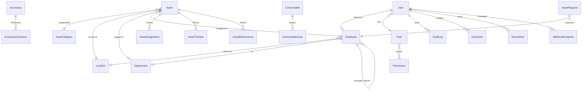

# NewVision — Project Documentation

> Internal reference for developers and operators. Last aligned with the codebase after **Prompt 19** (real helpdesk emails; re-verified against `design-reference/NewVision-standalone-src.html`). Everything below is verified against the actual repo — not the original build prompts.

---

## 1. Overview

NewVision is an internal IT asset management web application built for a company with roughly **1,250 serialized assets** and **1,180 employees** across **three office locations** (Pune, Hyderabad, Bhopal). It replaces spreadsheet-based tracking with a single system where IT staff can answer: how many assets exist, who has what, where each item is, its condition, warranty status, and where it sits in its lifecycle.

The product is deliberately scoped as a **focused inventory tool**, not an enterprise ITSM/CMDB suite. Serialized assets (laptops, monitors, desktops, etc.) are the core entity. Non-serialized supplies (mice, cables, toner) are tracked separately as **accessories** (checkout/check-in) and **consumables** (quantity-based issuing). Employees can report repair issues on assigned assets and submit asset/accessory requests; managers approve in one step; IT fulfills manually.

The stack is a **React + Refine + Ant Design** frontend talking to a **NestJS + PostgreSQL + Prisma** REST API. Authentication is JWT-based with five roles. All mutating operations are audited. The app ships with Docker Compose for local demo, seeded realistic data, Jest tests (unit + API integration), and Playwright browser tests.

---

## 2. Current status at a glance

| Phase / Prompt | Scope | Status |
|----------------|-------|--------|
| **Phase 0** — Scaffold | Monorepo, Docker, CI, Prisma, Refine shell | **Done** |
| **Phase 1** — Core foundation | Auth, RBAC, assets, org structure, dashboard metrics, import/export, audit, seed | **Done** |
| **Phase 2** — Operational depth | Maintenance/repairs, warranty alerts, notifications, reports (CSV/PDF) | **Done** |
| **Phase 3** — Scale & governance | Background import jobs, saved views, bulk actions, HR reconciliation | **Done** |
| **Phase 4** — QR & webhooks | QR PNG, public scan page, webhook subscriptions | **Done** |
| **Prompt 2** — Review, accessories, UX | Asset requests, accessories/consumables, attention panel, pagination, a11y tests, branding | **Done** |
| **Prompt 3** — Premium UI pass | `#1F1F1F` text hierarchy, depth/shadow system, accent `#2f54eb`, copy-button polish | **Done** |
| **Prompt 4** — Dashboard & import charts | Status donut, location bar, trend line, import outcome charts, `chartColors.ts` | **Done** |
| **Prompt 5** — This document | Full project documentation | **Done** (this file) |
| **Prompt 6** — DataGrid, Help, ship | Shared `DataGrid`, `/help` section, structured import errors, seed accessories/consumables | **Done** |
| **Prompt 8** — Self-audit | Offboarding, employee history, full DataGrid sweep, dashboard drill-down, RBAC hardening | **Done** |
| **Prompt 9** — Visual alignment | Match approved Claude Design mockup; `DESIGN_TOKENS.md`, `KpiCard`, theme/CSS refresh, Help screenshots | **Done** (superseded visually by Prompt 12) |
| **Audit** — Functionality | History truncation, DataGrid overflow tooltips, ticket search wiring, inactive-employee guards | **Done** — merged to `main` via PR #1 |
| **Prompt 12** — Merge + final design system | Fast-forward audit branch; exact tokens from `NewVision-standalone-src.html`; login/shell/dashboard/lists restyle | **Done** |
| **Prompt 13** — Investigation-based enhancements | Status-doc rewrite; tablet-width admin; light-only; first-run Welcome card; scan-page token pass | **Done** |
| **Prompt 14 v2** — Bugs + helpdesk | Growth chart, select-all, MANAGE/logos; Spiceworks-style support tickets | **Done** |
| **Prompt 15** — Helpdesk enhancements | CSAT, digest email, quick views, search, contact cards, duplicate-of, bulk, export | **Done** |
| **Prompt 16** — Notes & manual edit | Append-only notes; reason-required manual override; backfill; audit filter | **Done** |
| **Prompt 17** — Verified enhancement pass | Route-level code splitting + vendor chunks; cumulative growth chart; docs test-count correction; helpdesk/notes polish | **Done** |
| **Prompt 18** — Real helpdesk emails | Branded HTML templates for the full ticket lifecycle (created/assigned/unassigned/comment/status-change/resolved/digest); requester creation confirmation added | **Done** |
| **Prompt 19** — Re-verified against reference | Re-read the mockup directly; reverted an interim "futuristic" visual pass that had drifted from it; kept the command palette and a WCAG contrast fix found while re-testing | **Done** |
| **Help docs rebuild** | In-app MkDocs-Material-style documentation site (structure, not ING colors); accurate articles + real screenshots | **Done** |
| **Prompt 23 v2** — Vendor & Procurement | Vendors, requisitions, POs, GRN, 3-way match, contracts, scorecards; edit/amend/void with activity log | **Done** |

**Test counts (current, re-run 2026-09-11):** 81 backend unit + 111 backend integration = **192**; **68** Playwright (incl. axe-core).

**Design reference:** `design-reference/NewVision-standalone-src.html` (Prompt 12 source of truth, re-verified in Prompt 19) and `design-reference/DESIGN_TOKENS.md`. Earlier `NewVision_Asset_Manager.html` is historical.

---

## 3. Tech stack

Pulled from `backend/package.json`, `frontend/package.json`, and config files.

| Layer | Technology | Version (package.json) |
|-------|------------|------------------------|
| **Frontend runtime** | React | ^19.2.0 |
| **Frontend UI** | Ant Design (`antd`) | ^5.23.0 |
| **Frontend framework** | Refine (`@refinedev/core`, `@refinedev/antd`, `@refinedev/react-router`) | ^5.0.12 / ^6.0.3 / ^2.0.4 |
| **Frontend routing** | React Router | ^7.18.0 |
| **Frontend build** | Vite | ^7.3.6 |
| **Frontend charts** | `@ant-design/plots` | ^2.6.8 |
| **Frontend HTTP** | Axios | ^1.7.0 |
| **Frontend language** | TypeScript | ^7.0.0 |
| **Frontend lint/format** | Biome | ^2.5.12 |
| **Backend framework** | NestJS (`@nestjs/common`, `@nestjs/core`, …) | ^11.2.3 |
| **Backend ORM** | Prisma (`prisma`, `@prisma/client`) | 7.10.0 |
| **Database** | PostgreSQL 16 (via Docker Compose locally) | — |
| **DB driver** | `@prisma/adapter-pg` + `pg` | ^7.10.0 / ^8.23.0 |
| **Auth** | JWT (`@nestjs/jwt`, `passport-jwt`), passwords hashed with `bcrypt` | jwt ^11.0.2 |
| **Scheduling** | `@nestjs/schedule` (warranty cron) | ^5.0.1 |
| **Import/export** | ExcelJS, PapaParse | ^4.4.0 / ^5.7.0 |
| **PDF reports** | PDFKit | ^0.20.2 |
| **QR codes** | `qrcode` | ^1.5.4 |
| **Email** | Nodemailer (SMTP when configured, console fallback) | ^10.0.1 |
| **API docs** | Swagger (`@nestjs/swagger`) at `/api/docs` | ^11.4.7 |
| **Backend tests** | Jest 30 + `@swc/jest` + Supertest | ^30.0.0 / ^7.0.0 |
| **E2E tests** | Playwright + `@axe-core/playwright` | ^1.63.0 / ^4.13.0 |
| **Containerization** | Docker Compose (Postgres + backend + frontend) | `docker-compose.yml` |
| **CI** | GitHub Actions (`.github/workflows/ci.yml`) | lint, typecheck, unit, integration, Playwright |

**Auth approach:** Single JWT access token (no refresh-token rotation). Token sent as `Authorization: Bearer …` from the frontend Axios client. Global `JwtAuthGuard` on the API; `@Roles()` decorator + `RolesGuard` for role checks. Public routes (login, public scan/QR) use `@Public()`.

**Node:** README specifies Node 22+; project was developed on Node 24.

---

## 4. Architecture

### 4.1 Overall shape

```
┌─────────────────┐     HTTPS/HTTP REST      ┌─────────────────┐
│  React + Refine │  ◄──────────────────────►│  NestJS API     │
│  (Vite :5173)   │   JWT Bearer, JSON       │  (:3000/api)    │
└─────────────────┘                          └────────┬────────┘
                                                      │ Prisma
                                                      ▼
                                             ┌─────────────────┐
                                             │  PostgreSQL 16  │
                                             │  (newvision DB) │
                                             └─────────────────┘
```

- **Frontend** (`frontend/`): SPA served by Vite in dev; calls `VITE_API_URL` (default `http://localhost:3000/api`). Custom Refine `dataProvider` maps list pagination to `_start` / `_end` / `_sort` / `_order` query params.
- **Backend** (`backend/`): NestJS modules per domain; global prefix `api`; Swagger at `/api/docs`.
- **Database**: Single Postgres instance. Connection string in `DATABASE_URL`. Prisma 7 uses `prisma.config.ts` for CLI migrations and `@prisma/adapter-pg` at runtime.
- **Tests**: Unit tests mock Prisma; integration tests use real Postgres database `newvision_test` (created in Jest `globalSetup`).

### 4.2 Repository layout

```
IT_ADMIN/
├── backend/
│   ├── prisma/
│   │   ├── schema.prisma      # Full data model
│   │   ├── migrations/        # Applied SQL migrations
│   │   └── seed.ts            # Demo data (~1250 assets, 1180 employees, 5 users)
│   ├── src/
│   │   ├── auth/              # Login, JWT strategy, /auth/me
│   │   ├── assets/            # Asset CRUD, lifecycle, assign/transfer/retire/bulk
│   │   ├── accessories/       # Accessory catalog, checkout/checkin, stock adjust
│   │   ├── consumables/       # Consumable catalog, issue, low-stock
│   │   ├── asset-requests/    # Employee → manager → IT request flow
│   │   ├── employees/         # Employee list + profile
│   │   ├── locations/         # Location CRUD
│   │   ├── departments/       # Department CRUD
│   │   ├── categories/        # Asset category CRUD
│   │   ├── maintenance/       # Repair tickets + status transitions
│   │   ├── dashboard/         # Metrics, trends, by-location, attention
│   │   ├── search/            # Global search
│   │   ├── import-export/     # Sync CSV/Excel import + scoped export
│   │   ├── import-jobs/       # Background import jobs (Phase 3)
│   │   ├── saved-views/       # Saved filter views
│   │   ├── reconciliation/    # HR/inventory CSV diff
│   │   ├── reports/           # CSV/PDF report generation
│   │   ├── notifications/     # In-app notifications + warranty cron
│   │   ├── audit/             # Append-only audit log reader
│   │   ├── webhooks/          # Outbound webhook subscriptions
│   │   ├── qr/                # QR PNG generation helper
│   │   ├── public-assets/     # Unauthenticated scan/QR endpoints
│   │   └── common/            # RBAC, guards, lifecycle, warranty utils
│   └── test/                  # Jest integration (e2e API) suites
├── frontend/
│   ├── src/
│   │   ├── pages/             # One folder per screen area
│   │   ├── components/        # Shared UI (Header, CopyButton, charts, tags, …)
│   │   ├── providers/         # authProvider, dataProvider, axios (JWT interceptor)
│   │   ├── hooks/             # useRefinePagination, useTableKeyboard
│   │   ├── chartColors.ts     # Data-viz palette (Prompt 4)
│   │   └── theme.ts           # Ant Design theme tokens
│   ├── e2e/                   # Playwright specs + helpers
│   └── public/brand/          # Logo, favicon PNGs
├── docker-compose.yml
├── PROJECT_STATUS.md          # Gap audit & deliberate exclusions
├── PROGRESS.md                # Phase-by-phase build log
├── DECISIONS.md               # Architecture & product judgment calls
└── README.md                  # Quick start & testing
```

### 4.3 Data model

All tables are defined in `backend/prisma/schema.prisma`. Postgres table names use snake_case via `@map`.

#### Core entities

| Table | Purpose | Key fields |
|-------|---------|------------|
| `roles` | RBAC role definitions | `name` (`RoleName` enum), links to `permissions` |
| `permissions` | Permission keys (`asset:create`, etc.) | `key` (unique string) |
| `users` | Login accounts | `email`, `password_hash`, `role_id`, optional `employee_id` |
| `locations` | Physical sites | `code` (PUN/HYD/BHO), `name`, `city`, `address` |
| `departments` | Org departments | `name` (unique) |
| `employees` | People | `employee_code`, `first_name`, `last_name`, `email`, `location_id`, `department_id`, `manager_id` (self-relation) |
| `asset_categories` | Asset types | `code` (LAP/DES/MON), `name` |
| `assets` | Serialized IT assets | `asset_code` (AST-{LOC}-{CAT}-{SEQ}), `serial_number`, `status`, `condition`, `location_id`, `assigned_employee_id`, warranty/purchase fields |
| `asset_assignments` | Assignment history | `asset_id`, `employee_id`, `assigned_at`, `returned_at` |
| `asset_transfers` | Transfer history | `from/to` employee and location, `transferred_at`, `reason` |
| `asset_maintenance` | Repair tickets | `issue`, `status` (`MaintenanceStatus`), vendor/cost/dates |

#### Governance & integrations

| Table | Purpose | Key fields |
|-------|---------|------------|
| `audit_logs` | Append-only change log | `entity_type`, `entity_id`, `action` (`AuditAction`), `summary`, `old_value`/`new_value` JSON |
| `notifications` | In-app alerts | `type`, `title`, `message`, optional `user_id`, `asset_id`, `is_read` |
| `import_jobs` | Background imports | `kind`, `filename`, `status`, `mapping` JSON, counts, `file_data` bytea, `errors`/`preview` JSON |
| `saved_views` | Saved list filters | `resource`, `filters` JSON, `is_shared`, `created_by_id` |
| `reconciliation_runs` | HR/inventory diff runs | `kind`, `match_field`, counts, `findings` JSON |
| `webhook_endpoints` | Outbound webhooks | `url`, `secret`, `events[]`, delivery status fields |

#### Prompt 2 entities

| Table | Purpose | Key fields |
|-------|---------|------------|
| `asset_requests` | Employee requests | `kind` (asset/accessory), `category_id` or `accessory_name`, `reason`, `status`, reviewer/fulfiller refs |
| `accessories` | Non-serialized reusables | `name`, `category`, `quantity_total`, `quantity_checked_out` |
| `accessory_checkouts` | Checkout rows | `accessory_id`, `employee_id`, `quantity`, `checked_out_at`, `checked_in_at` |
| `consumables` | Depletable stock | `quantity_total`, `quantity_available`, `low_stock_threshold` |
| `consumable_issues` | Issue rows | `consumable_id`, `employee_id`, `quantity`, `issued_at` |

#### Entity relationships (summary)



**Asset code generation:** `AST-{locationCode}-{categoryCode}-{sequence}` via `backend/src/assets/asset-code.ts`.

---

## 5. Features — what's actually implemented

### 5.1 Authentication & roles

**How it works:** `POST /api/auth/login` with `{ email, password }` returns `{ accessToken, user }`. Frontend stores token; Axios interceptor attaches it. `GET /api/auth/me` returns user + permission keys.

**Roles and effective capabilities** (from `backend/src/common/rbac/permissions.ts`):

| Role | Can do (high level) |
|------|---------------------|
| **SUPER_ADMIN** | Everything including user management, asset delete, audit read |
| **IT_ADMIN** | Full asset lifecycle, org CRUD, maintenance manage, import/export, reports, audit read, webhooks, fulfill requests |
| **IT_SUPPORT** | Read assets/employees, manage maintenance queue, run reports |
| **MANAGER** | Read assets/employees, approve/reject direct-report requests, run reports |
| **EMPLOYEE** | Read assets (scoped), report issues on own assigned assets, submit asset/accessory requests |

**Status:** Fully working. RBAC enforced on controllers via `@Roles()`. Employees see a reduced UI (e.g. no assign/retire buttons) matching API enforcement. Playwright `auth.spec.ts` verifies employee cannot see management actions.

**Not implemented:** Refresh tokens, SSO/LDAP, password reset, user self-registration.

---

### 5.2 Assets

**CRUD:** `GET/POST /api/assets`, `GET/PUT/DELETE /api/assets/:id`. List supports filters (`status`, `locationId`, `categoryId`, `departmentId`, `q`), pagination, sorting.

**Lifecycle state machine** (`backend/src/assets/lifecycle.ts`):

| From status | Allowed transitions |
|-------------|----------------------|
| `available` | `assigned`, `pending_assignment`, `under_repair`, `retired` |
| `pending_assignment` | `assigned`, `available` |
| `assigned` | `available`, `under_repair`, `lost`, `damaged`, `retired` |
| `under_repair` | `assigned`, `available`, `lost`, `damaged`, `retired` |
| `lost` | `available`, `retired` |
| `damaged` | `under_repair`, `available`, `retired` |
| `retired` | `disposed` |
| `disposed` | *(terminal)* |

**Actions (not separate statuses):**
- **Assign** — `POST /api/assets/:id/assign` → sets `assigned`, creates `AssetAssignment`. Optional `accessoryIds[]` checks out accessories in same call.
- **Transfer** — `POST /api/assets/:id/transfer` → changes location and/or assignee; records `AssetTransfer`. Asset stays `assigned` if an employee remains.
- **Retire** — `POST /api/assets/:id/retire` → `retired` with reason; audited.
- **Change status** — `POST /api/assets/:id/status` for other allowed transitions.
- **Bulk** — `POST /api/assets/bulk` with `status` \| `transfer` \| `retire`; per-id success/failure.

**Frontend:** `frontend/src/pages/assets/` — list with filters, saved views, bulk modals, expand rows, keyboard shortcuts (`/` focuses search, ↑↓ row focus); create/edit/show pages; assign/transfer/retire modals on list and show.

**Status:** Fully working. Lifecycle violations return 400 with clear messages. Unit tests in `lifecycle.spec.ts`; e2e in `assets.spec.ts`.

---

### 5.3 Accessories & consumables

**Accessories** (`/api/accessories`):
- List/get open to authenticated users; create/update/stock-adjust/checkout/checkin restricted to **SUPER_ADMIN** and **IT_ADMIN**.
- Tracks `quantity_total` vs `quantity_checked_out`; checkout creates `AccessoryCheckout`; check-in sets `checked_in_at`.

**Consumables** (`/api/consumables`):
- Same role pattern for write operations.
- **Issue** decrements `quantity_available`; low stock triggers `low_stock` notifications and appears on dashboard attention panel.

**Frontend:** `/accessories`, `/consumables` list pages with modals for CRUD, checkout, issue, stock adjust.

**Status:** Fully working backend + UI. **Limitation:** `prisma/seed.ts` does **not** seed accessories or consumables — catalog pages are empty on fresh seed until items are created via UI or tests.

---

### 5.4 Employees & locations

**Employees:** `GET /api/employees` (list), `GET /api/employees/:id` (profile with assigned assets, accessory checkouts, consumable issues). Managers viewing profiles are scoped to **direct reports only** (Prompt 2 fix).

**Locations:** Full CRUD at `/api/locations` (IT Admin+). Frontend list/create/edit at `/locations`.

**Departments & categories:** Backend CRUD exists; used in asset forms and filters. No dedicated frontend nav pages — managed implicitly through asset/employee flows.

**Status:** Fully working for implemented surfaces.

---

### 5.5 Maintenance / repairs

**Flow:** Employee reports issue → ticket `reported` → IT starts repair (`under_repair`, asset → `under_repair`) → mark `repaired` → `reassigned` (asset back to `assigned` or `available`) or `cancelled`.

**Maintenance state machine** (`maintenance-status.ts`): `reported → under_repair → repaired → reassigned`; `cancelled` from `reported`/`under_repair`.

**API:** `/api/maintenance` — list, create (employees limited to own assigned assets), transition endpoints.

**Frontend:** `/maintenance` — queue table, Report Issue modal, per-status action buttons. Employees see report-only view.

**Status:** Fully working. Coupled asset status changes run in same Prisma transaction. E2e: `maintenance.spec.ts`.

---

### 5.5b Support tickets (IT helpdesk)

Separate from Maintenance (hardware repairs on one asset) and Asset Requests (asking for new kit). Used for software, network, access, and general issues.

**Lifecycle:** `open → assigned → in_progress → resolved → closed`, plus `reopened`. Ticket numbers `TCK-000123`. Categories (Software / Network / Access & Account / Hardware-other / General) carry a default priority the requester can override.

**API:** `/api/support-tickets` (CRUD + assign/transition/comments/watchers/time/rate/duplicate/bulk/export), `/api/ticket-categories`, `/api/ticket-templates`, `/api/canned-responses`, `/api/notes`, `/api/records/:entityType/:id/manual`.

**RBAC:** any employee creates and sees own + watched tickets (public comments only). IT Support / IT Admin / Super Admin manage the queue, internal notes, time, canned/templates, reports. Managers see own + direct reports; no assign/internal/time.

**Also:** CSAT 1–5 on resolve; IT email Immediate vs Daily digest (`POST /api/support-tickets/digest/run`); quick views; full-text `q`; contact cards; duplicate-of; CSV/PDF export.

**Email:** every lifecycle event sends a real, branded HTML email (not just an in-app notification) — ticket created (confirmation to the requester), assigned (to the assignee), a new unassigned ticket (to IT Admin/Support), a public comment (to requester + watchers, and to the assignee if the requester commented), a status change (requester + watchers), the resolve→rate prompt (requester), and the daily digest (IT staff who chose that preference). Templates live in `backend/src/notifications/ticket-email-templates.ts` — one function per event returning `{ subject, text, html }`, rendered through a shared inline-styled shell (logo, `#0958D9` accent, one CTA button) so every email looks the same shape. `MailerService.send` takes an optional `html` field and falls back to `text` / a console log line when `SMTP_HOST` isn't set — nothing crashes or blocks in an unconfigured environment. Staff on `daily_digest` never get the immediate versions (existing digest-skip rule, unchanged). Covered by `backend/test/ticket-emails.e2e-spec.ts`, which spies `MailerService.send` and asserts the right subject/template fires per event.

**Status:** Fully working. E2e: `backend/test/tickets.e2e-spec.ts`, `backend/test/ticket-emails.e2e-spec.ts`, `frontend/e2e/tickets.spec.ts`.

---

### 5.5c Notes and manual correction

**Notes:** `GET/POST /api/notes?entityType=&entityId=` — append-only freeform notes on Asset, Employee, Accessory, Consumable, AssetMaintenance, AssetRequest, SupportTicket, Location. Viewers can read; editors of that record type can add. Past `occurredAt` is tagged **Backfilled**.

**Manual edit:** `POST /api/records/:entityType/:id/manual` — Super Admin and IT Admin only. Mandatory `reason`, field whitelist, enum/FK validation still applies. Audit `action=manual_override`. Backfill assignment: `POST /api/records/Asset/:id/backfill-assignment`.

**Status:** Fully working. Covered in `tickets.e2e-spec.ts` and Help article `notes-manual-edit`.

---

### 5.5d Vendor & procurement (Prompt 23 v2)

Buying cycle after a need is known: vendors → requisition (company email template) → parallel To/Cc approval → PO → GRN (partials + void) → vendor invoice 3-way match → contracts/SLAs with renewal alerts. Received POs auto-create assets / accessory-consumable stock / license entitlements; later PO/GRN changes **flag** those records for reconciliation instead of deleting them.

**API:** `/api/vendors`, `/api/purchase-requisitions`, `/api/purchase-orders` (convert, amend, send, receipts, void, invoices, PDF), `/api/vendor-contracts`, `/api/procurement` (matrix, summary, renewal-check). Reports: `procurement-spend`, `procurement-open`, `procurement-renewals`, `procurement-overdue`, `procurement-scorecards`.

**RBAC:** Super Admin / IT Admin manage the module. Managers raise and see team requisitions (`procurement:request`). IT Support and Employees have no procurement nav.

**Status:** Fully working. E2e: `backend/test/prompt23-procurement.e2e-spec.ts`, `frontend/e2e/prompt23-procurement.spec.ts`. Help: Procurement category.

---

### 5.6 Warranty tracking & alerts

**Data:** `assets.warranty_start`, `assets.warranty_end`; UI shows days remaining via `WarrantyDays` component.

**Alerts:** `WarrantyAlertService` cron (daily 08:00) creates de-duplicated `warranty_expiry` notifications at 90/60/30 days remaining. Email via SMTP if configured, else console log. Manual trigger: `POST /api/warranty/run-check`.

**Dashboard:** `GET /api/dashboard/warranty-expiring?withinDays=90`; warranty ≤7 days also surface in attention panel.

**Status:** Fully working.

---

### 5.7 Reports

**Types:** asset, employee, location, warranty (+ **Supplies** report for accessories/consumables added in Prompt 2).

**API:** `GET /api/reports/:type?format=csv|pdf` — requires `report:run` permission.

**Frontend:** `/reports` — download buttons per report type.

**Status:** Fully working. E2e: `reports.spec.ts`.

---

### 5.8 Import / export & import run history

**Sync import (Phase 1):** `POST /api/import/assets`, `POST /api/import/employees` — immediate processing for small files. Assets list also has CSV upload.

**Scoped export:** `GET /api/export/assets` with same filter params as list; returns 400 if zero rows; `X-Row-Count` header; filename reflects scope.

**Background import jobs (Phase 3):** `/api/import-jobs` — upload → column mapping → dry-run preview (duplicates flagged) → commit (in-process via `setImmediate`) → rollback (deletes created IDs). File stored as `bytea` on job row.

**Import run history UI:** Settings → Import jobs tab — table with expandable rows (started/completed/duration/counts). **Prompt 4:** outcome donut + failure-category bar chart on completed jobs (`ImportResultChart`).

**Status:** Fully working. In-process queue (no Redis). E2e: `governance.spec.ts` (dry-run, reconcile).

---

### 5.9 Asset requests & approval

**Flow:** Employee submits (`POST /api/asset-requests`) → Manager approves/rejects (`POST …/review`) → IT Admin marks fulfilled (`POST …/fulfill`). States: `pending → approved|rejected → fulfilled`.

**Not a workflow engine** — single manager step, manual IT fulfillment (no auto-assign).

**Frontend:** `/requests` — role-specific columns and actions; review modal with comment/rejection reason.

**Status:** Fully working. E2e: `requests.spec.ts`. Demo employee reports to demo manager in seed.

---

### 5.10 Notifications

**API:** `GET /api/notifications`, `PATCH /api/notifications/:id/read`.

**Sources:** Warranty alerts, issue reported, repair status, low stock, asset requests, assignments, support-ticket events (create/assign/status/comment). IT staff can choose Immediate vs Daily digest for **email** only.

**Frontend:** `NotificationBell` in `Header.tsx` — unread count badge, dropdown list.

**Status:** Fully working.

---

### 5.11 Dashboard & data visualizations

**API endpoints:**
- `GET /api/dashboard/metrics?locationId=` — counts + `byStatus` breakdown
- `GET /api/dashboard/setup` — estate counts + `freshInstall` (true only when assets, employees, and locations are all zero)
- `GET /api/dashboard/by-location` — per-site totals
- `GET /api/dashboard/trends?months=12&locationId=` — monthly assets added
- `GET /api/dashboard/warranty-expiring`
- `GET /api/dashboard/attention` — warranty urgent, stale repairs, low stock, requests to fulfill

**Frontend (`dashboard.tsx`):**
- Metric cards with location filter
- **Needs attention** panel (linked items)
- **Charts (Prompt 4):** status donut, location bar (hidden when location filtered), 12-month trend, sparkline on Total card
- Warranty expiring table

**Status:** Fully working.

---

### 5.12 Audit logging

**Storage:** `audit_logs` table — append-only at application layer (insert + select only).

**API:** `GET /api/audit-logs` — **SUPER_ADMIN** and **IT_ADMIN** only.

**Coverage:** Asset CRUD, assign, transfer, retire, status changes, imports, accessory/consumable actions, request approve/reject/fulfill, support tickets, notes, and flagged `manual_override` corrections (filterable).

**Frontend:** `/audit-logs` — paginated table with expand rows.

**Status:** Fully working.

---

### 5.13 Other implemented features

| Feature | Details | Status |
|---------|---------|--------|
| **Global search** | `GET /api/search?q=` — assets, employees, maintenance, helpdesk; header `#global-search-input` | Done — `search.spec.ts` |
| **Saved views** | `GET/POST /api/saved-views`; assets list picker + save | Done — `governance.spec.ts` |
| **Reconciliation** | Settings tab; HR CSV set-diff on employee code/email or asset code/serial | Done — manual upload only |
| **QR codes** | `GET /api/assets/:id/qr`, public PNG + scan data | Done |
| **Public scan page** | `/scan/:code` — no login; phone-first card (Prompt 12 tokens) | Done — `scan.spec.ts`, `prompt13.spec.ts` |
| **Webhooks** | Settings → Webhooks; `asset.created`, `asset.status_changed`; HMAC signature | Done |
| **First-run onboarding** | Welcome card when estate is empty (`GET /dashboard/setup`) | Done — `prompt13.spec.ts` |
| **Tablet admin layout** | Sider collapses ≤1023px; tables scroll; not a phone rewrite | Done — `prompt13.spec.ts` |
| **Light-only** | OS dark preference cannot invert chrome | Done — `prompt13.spec.ts` |
| **Copy to clipboard** | `CopyButton` component on asset codes/serials with toast feedback | Done |
| **Keyboard shortcuts** | `/` global search, `Esc`, ↑↓ on assets/employees tables | Partial — not all list screens |
| **Branding** | `frontend/public/brand/` logos + favicon; used in `Title.tsx`, login | Done |
| **Accessibility** | axe-core in Playwright on dashboard, assets list, tickets list, raise-ticket form, asset notes | Done — `a11y.spec.ts` |

---

## 6. What was intentionally NOT built

From `PROJECT_STATUS.md` / product scope — these are **deliberate exclusions**, not bugs:

| Excluded capability | Why |
|--------------------|-----|
| CMDB / CI relationship graphs | Enterprise CMDB scope; ~1,250 assets don't need dependency mapping |
| IT service catalog & SLAs | ITSM suite territory |
| Full ticketing / change / release management | Maintenance module covers repair only |
| IT governance, vuln/patch management | Security ops platform scope |
| Live AD/Entra sync, JML automation | Chose manual CSV import + reconciliation instead |
| Full IT financials / e-sourcing / OCR invoices / payment execution | Prompt 23 tracks vendors, POs, GRNs, invoice *status*, and contracts only |
| General-purpose workflow engine | Matrix-based requisition approval (parallel by default), not a workflow designer |
| Live reconciliation engine | Manual CSV upload diff instead |
| Network auto-discovery | Not applicable to manual inventory |
| AI / natural-language search | Out of scope |
| Redis/job queue for imports | In-process `setImmediate` chosen for local-dev simplicity |
| JWT refresh tokens | Simplicity for internal tool; noted as future hardening |
| Dark mode | Approved design system is light-only; OS dark preference is forced to light |
| Phone-width authenticated admin | Tablet is the floor; phones use the public scan page |

---

## 7. Known issues / incomplete work

### From PROGRESS.md

- **Seed resets on container restart** when `SEED_ON_START=true` (docker-compose default). Set `SEED_ON_START: "false"` after first boot to persist manual changes.
- **Playwright create-asset test** accumulates duplicate demo assets across runs (harmless; reseed to clean).

### From codebase review (honest gaps)

| Item | Detail |
|------|--------|
| **JWT refresh** | Access token only; 8h expiry (`JWT_EXPIRES_IN`). |
| **Seed resets on restart** | `SEED_ON_START=true` wipes manual demo edits on backend boot. |
| **Phone-width admin app** | Explicit non-goal. Tablet (768–1023px) is supported; phones use `/scan/:code`. |
| **Dark mode** | Explicit non-goal. Light-only; OS dark preference is forced to the approved light tokens. |

---

## 8. How to run it

### Option A — Docker (recommended)

Requires Docker Desktop.

```bash
cd IT_ADMIN
docker compose up --build
```

| Service | URL |
|---------|-----|
| Frontend | http://localhost:5173 |
| Backend API | http://localhost:3000/api |
| Swagger | http://localhost:3000/api/docs |
| Postgres | localhost:5432 — db/user/pass: `newvision` |

Backend entrypoint runs `prisma migrate deploy` and seeds when `SEED_ON_START=true`.

**Demo logins** (all passwords: `Password123!`):

| Role | Email |
|------|-------|
| Super Admin | `superadmin@newvision.local` |
| IT Admin | `itadmin@newvision.local` |
| IT Support | `support@newvision.local` |
| Manager | `manager@newvision.local` |
| Employee | `employee@newvision.local` |

### Option B — Local without Docker

Prerequisites: **Node 22+**, **PostgreSQL 16**. Create databases `newvision` and `newvision_test`.

**Backend:**

```bash
cd backend
cp .env.example .env          # set DATABASE_URL, JWT_SECRET, etc.
npm install
npx prisma generate
npx prisma migrate deploy
npm run seed
npm run start:dev               # → http://localhost:3000/api
```

**Frontend:**

```bash
cd frontend
npm install
npm run dev                     # → http://localhost:5173
# Optional: VITE_API_URL=http://localhost:3000/api
```

**Environment variables** (`backend/.env.example`):

| Variable | Purpose |
|----------|---------|
| `DATABASE_URL` | Postgres connection string |
| `JWT_SECRET` | Signing key (change in production) |
| `JWT_EXPIRES_IN` | Token TTL (default `8h`) |
| `CORS_ORIGIN` | Frontend origin(s) |
| `SMTP_*` / `MAIL_FROM` | Warranty alerts and the full helpdesk ticket lifecycle (optional — console log when unset) |
| `PUBLIC_APP_URL` | Base URL encoded in QR codes and in email logo/CTA links (default `http://localhost:5173`) |

---

## 9. How to test it

### Backend unit tests (58 tests)

Pure logic: asset lifecycle transitions, RBAC matrix, warranty date math, asset code generation, import column mapping/duplicates, reconciliation diff, maintenance transitions, webhook HMAC, scan URL builder, cumulative growth-trend points.

```bash
cd backend
npm run lint
npm run typecheck
npm test
```

### Backend integration / API tests (84 tests)

Hit real HTTP endpoints against `newvision_test` Postgres. Suites: `auth`, `assets`, `features`, `phase2`, `phase3`, `phase4`, `prompt2`, `audit-fixes`, `employees-offboard`, `tickets`, `ticket-emails`.

```bash
cd backend
npm run test:e2e    # needs Postgres reachable
```

### Frontend

```bash
cd frontend
npm run lint
npm run typecheck
npm run build
```

### Playwright e2e (68 tests)

Drives real UI against seeded backend on `:3000`; auto-starts Vite dev server.

```bash
# Terminal 1
cd backend && npm run start:dev

# Terminal 2
cd frontend
npx playwright install chromium   # first time
npm run test:e2e
npm run test:e2e:report           # HTML report
```

| Spec file | Covers |
|-----------|--------|
| `auth.spec.ts` | Login, logout, employee RBAC UI |
| `assets.spec.ts` | Create, assign, transfer, CSV import |
| `search.spec.ts` | Command-palette search → asset detail |
| `maintenance.spec.ts` | Report issue, start repair |
| `reports.spec.ts` | CSV + PDF downloads |
| `governance.spec.ts` | Saved view, import dry-run, HR reconcile |
| `scan.spec.ts` | Public scan page without login |
| `requests.spec.ts` | Employee submit → manager approve → IT fulfill |
| `a11y.spec.ts` | axe-core WCAG2a/2aa on dashboard, assets, tickets, raise-ticket, asset notes |
| `prompt13.spec.ts` | First-run welcome, tablet sider, light-only, phone scan |
| `prompt14-bugs.spec.ts` | Growth chart scale, select-all checkbox, MANAGE color + logos |
| `prompt17.spec.ts` | Lazy routes, cumulative growth API + chart, favicon/collapsed mark |
| `tickets.spec.ts` | Raise ticket (blank + template), IT queue, comments/time/export, Help, notes/manual edit |
| `help.spec.ts` | Docs home + At a Glance, nav tree expand/collapse, auto ToC, search (page + heading), every article H1, skip-link / Home |
| `employee-history.spec.ts` | History tab + dashboard drill-down |
| `audit-fixes.spec.ts` | Offboard/reinstate, audit filter, search → maintenance |
| `prompt23-procurement.spec.ts` | Procurement nav + requisition template fields; employees Active only in Status |

**Accessibility:** Implemented as Playwright tests using `@axe-core/playwright` — not a separate npm script. Serious/critical violations fail the build.

### CI

GitHub Actions (`.github/workflows/ci.yml`): backend lint/typecheck/unit/integration → frontend lint/typecheck/build → Playwright with Postgres service container.

---

## 10. Key decisions and why

Summarized from `DECISIONS.md` — things a future developer should not accidentally undo:

1. **Monorepo, two package.jsons** — no npm workspaces; Nest and Vite stay independent.
2. **NestJS 11 (CommonJS), not 12** — Jest cannot require Nest 12's ESM packages; v11 keeps tests working.
3. **Ant Design 5 + Refine 5** — `@refinedev/antd` requires AntD 5; AntD 6 was planned but incompatible.
4. **Prisma 7.10.0 with `@prisma/adapter-pg`** — Prisma 7 removed datasource URL from schema; driver adapter required.
5. **Biome instead of ESLint** — TypeScript 7 unsupported by typescript-eslint at build time.
6. **JWT access token only** — no refresh rotation yet; bcrypt password hashing.
7. **RBAC at API layer** — `ROLE_PERMISSIONS` in `permissions.ts` is single source of truth; UI hides actions but API is authoritative.
8. **Asset lifecycle as explicit transition table** — illegal transitions throw `InvalidTransitionError`; idempotent same-status allowed.
9. **Maintenance coupled to asset status in one transaction** — ticket transition and asset status change never diverge.
10. **Accessories/consumables separate from assets** — quantity-based, not serialized; no fake asset codes for mice/cables.
11. **Asset requests = single-step approval** — not a workflow engine; IT fulfills manually.
12. **In-process import jobs** — no Redis; file stored as bytea; rollback deletes recorded IDs only.
13. **QR encodes frontend scan URL** — public endpoints intentional; scan page omits cost/history.
14. **Webhooks awaited in-request (2.5s timeout)** — failures stored on endpoint, never thrown to caller.
15. **Chart colors separate from UI chrome** — `#2f54eb` accent for buttons; `chartColors.ts` for data viz only.
16. **Scoped export returns 400 on empty** — prevents accidental full-database downloads when filters too narrow.

---

## 11. Screenshots

Help articles embed PNGs from `frontend/public/docs/screenshots/`, captured against the running app (`cd frontend && npm run screenshots`). Recapture after chrome changes. The script logs in as `itadmin@newvision.local` except `requests.png` (employee) and `scan-page.png` (logged out).

| Placeholder | Suggested capture |
|-------------|-------------------|
| `[SCREENSHOT: dashboard overview]` | `/` — metric cards, attention panel (if any), three charts, warranty table |
| `[SCREENSHOT: assets list]` | `/assets` — filters, saved view picker, table with status tags |
| `[SCREENSHOT: asset detail]` | `/assets/show/:id` — detail fields, QR card, action buttons |
| `[SCREENSHOT: assign modal]` | Assets list or show → Assign modal with optional accessory checkboxes |
| `[SCREENSHOT: transfer modal]` | Assets list or show → Transfer modal (location/employee) |
| `[SCREENSHOT: employee profile]` | `/employees/show/:id` — assigned assets, accessories, consumables sections |
| `[SCREENSHOT: maintenance queue]` | `/maintenance` — repair table + Report Issue |
| `[SCREENSHOT: accessories list]` | `/accessories` — catalog (create a row first if empty) |
| `[SCREENSHOT: consumables list]` | `/consumables` — stock table + issue modal |
| `[SCREENSHOT: reports page]` | `/reports` — four report types with CSV/PDF buttons |
| `[SCREENSHOT: asset requests]` | `/requests` — as employee (pending) or manager (review) |
| `[SCREENSHOT: notifications bell]` | Header notification dropdown open |
| `[SCREENSHOT: import job summary]` | Settings → Import jobs — expanded completed job with charts |
| `[SCREENSHOT: audit log]` | `/audit-logs` — paginated audit entries |
| `[SCREENSHOT: public scan page]` | `/scan/AST-PUN-LAP-0001` — logged out, mobile width |
| `[SCREENSHOT: help panel]` | `/help` — article chrome + screenshots under `frontend/public/docs/screenshots/` |

**Suggested storage:** `docs/screenshots/` with matching filenames (e.g. `dashboard.png`).

---

## 12. What would come next

Reasonable increments given what exists today — not the excluded enterprise wishlist:

1. **JWT refresh tokens / session hardening** — noted since Phase 0 as deferred security work.
2. **Extend keyboard shortcuts** — to maintenance, audit, requests, accessories tables (global `/` search already works).
3. **Self-service first admin** — a migrate-only database still needs a user before anyone can see the Welcome card.
4. **Screenshot gallery refresh** — recapture Help shots after any future chrome change (`frontend/scripts/capture-screenshots.mjs`).

Tablet layout, light-only, and first-run onboarding shipped in Prompt 13. Prompt 3 Help, seed accessories, structured import codes, and DataGrid are already done.

For the full list of deliberately excluded enterprise features, see `PROJECT_STATUS.md` §8.

---

*Related docs: [`README.md`](./README.md) (quick start), [`PROGRESS.md`](./PROGRESS.md) (build log), [`DECISIONS.md`](./DECISIONS.md) (judgment calls), [`PROJECT_STATUS.md`](./PROJECT_STATUS.md) (gap audit).*
